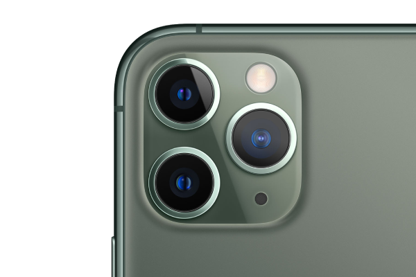

<h1 align="center">Vision Camera</h1>

<div align="center">
  
  <br />
  <br />
  <blockquote><b>📸 The Camera library that sees the vision.</b></blockquote>
  <pre align="center">npm i <a href="https://www.npmjs.com/package/react-native-vision-camera">react-native-vision-camera</a><br/>npx pod-install                 </pre>
  <a align="center" href='https://ko-fi.com/F1F8CLXG' target='_blank'>
    
  </a>
  <br/>
  <a align="center" href="https://github.com/mrousavy?tab=followers">
    
  </a>
  <br />
  <a align="center" href="https://twitter.com/mrousavy">
    
  </a>
</div>

<br/>
<br/>

<div>
  
</div>

### Documentation

* [Guides](https://mrousavy.github.io/react-native-vision-camera/docs/guides)
* [API](https://mrousavy.github.io/react-native-vision-camera/docs/api)
* [Example](./example/)

### Features

* Photo, Video and Snapshot capture
* Customizable devices and multi-cameras (smoothly zoom out to "fish-eye" camera)
* Customizable FPS
* [Frame Processors](https://mrousavy.github.io/react-native-vision-camera/docs/guides/frame-processors) (JS worklets to run QR-Code scanning, facial recognition, AI object detection, realtime video chats, ...)
* Smooth zooming (Reanimated)
* Fast pause and resume
* HDR & Night modes

> See the [example](./example/) app

### Example

```tsx
function App() {
  const devices = useCameraDevices('wide-angle-camera')
  const device = devices.back

  if (device == null) return <LoadingView />
  return (
    <Camera
      style={StyleSheet.absoluteFill}
      device={device}
      isActive={true}
    />
  )
}
```

### Adopting at scale

<a href="https://github.com/sponsors/mrousavy">
  
</a>

VisionCamera is provided _as is_, I work on it in my free time.

If you're integrating VisionCamera in a production app, consider [funding this project](https://github.com/sponsors/mrousavy) and <a href="mailto:me@mrousavy.com?subject=Adopting VisionCamera at scale">contact me</a> to receive premium enterprise support, help with issues, prioritize bugfixes, request features, help at integrating VisionCamera and/or Frame Processors, and more.

<br />

#### 🚀 Get started by [setting up permissions](https://mrousavy.github.io/react-native-vision-camera/docs/guides/)!
