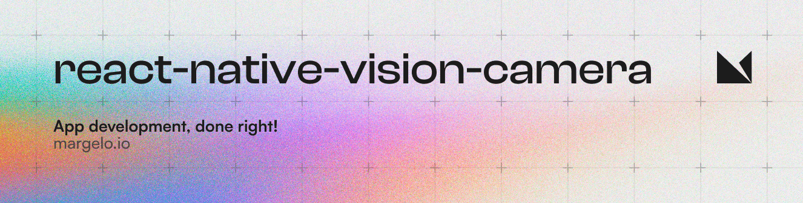

<a href="https://margelo.io">
  <picture>
    <source media="(prefers-color-scheme: dark)" srcset="./docs/static/img/banner-dark.png" />
    <source media="(prefers-color-scheme: light)" srcset="./docs/static/img/banner-light.png" />
    
  </picture>
</a>

<br />

<div>
  
</div>

### Features

VisionCamera is a powerful and fast Camera component for React Native. It features:

* 📸 Photo and Video capture
* 📱 Customizable devices and multi-cameras ("fish-eye" zoom)
* 🎞️ Customizable resolutions and aspect-ratios (4k/8k images)
* ⏱️ Customizable FPS (30..240 FPS)
* 🧩 [Frame Processors](https://react-native-vision-camera.com/docs/guides/frame-processors) (JS worklets to run QR-Code scanning, facial recognition, AI object detection, realtime video chats, ...)
* 🔍 Smooth zooming (Reanimated)
* ⏯️ Fast pause and resume
* 🌓 HDR & Night modes
* ⚡ Custom C++/GPU accelerated video pipeline (OpenGL)

Install VisionCamera from npm:

```sh
yarn add react-native-vision-camera
cd ios && pod install
```

..and get started by [setting up permissions](https://react-native-vision-camera.com/docs/guides)!

### Documentation

* [Guides](https://react-native-vision-camera.com/docs/guides)
* [API](https://react-native-vision-camera.com/docs/api)
* [Example](./package/example/)
* [Frame Processor Plugins](https://react-native-vision-camera.com/docs/guides/frame-processor-plugin-list)

### V3

You're looking at the V3 version of VisionCamera, which features a full rewrite on the Android codebase and a huge refactor on the iOS codebase. If you encounter issues on V3, you can also [downgrade to V2](https://github.com/mrousavy/react-native-vision-camera/tree/v2), which is still partially supported.

### Example

```tsx
function App() {
  const device = useCameraDevice('back')

  if (device == null) return <NoCameraErrorView />
  return (
    <Camera
      style={StyleSheet.absoluteFill}
      device={device}
      isActive={true}
    />
  )
}
```

> See the [example](./package/example/) app

### Adopting at scale

<a href="https://github.com/sponsors/mrousavy">
  
</a>

VisionCamera is provided _as is_, I work on it in my free time.

If you're integrating VisionCamera in a production app, consider [funding this project](https://github.com/sponsors/mrousavy) and <a href="mailto:me@mrousavy.com?subject=Adopting VisionCamera at scale">contact me</a> to receive premium enterprise support, help with issues, prioritize bugfixes, request features, help at integrating VisionCamera and/or Frame Processors, and more.

### Socials

* 🐦 [**Follow me on Twitter**](https://twitter.com/mrousavy) for updates
* 📝 [**Check out my blog**](https://mrousavy.com/blog) for examples and experiments
* 💬 [**Join the Margelo Community Discord**](https://discord.gg/6CSHz2qAvA) for chatting about VisionCamera
* 💖 [**Sponsor me on GitHub**](https://github.com/sponsors/mrousavy) to support my work
* 🍪 [**Buy me a Ko-Fi**](https://ko-fi.com/mrousavy) to support my work
