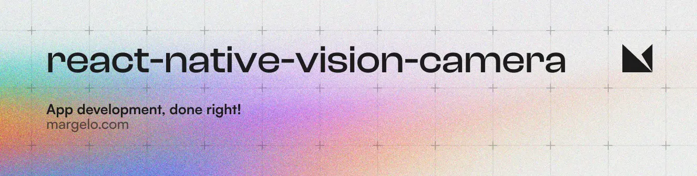
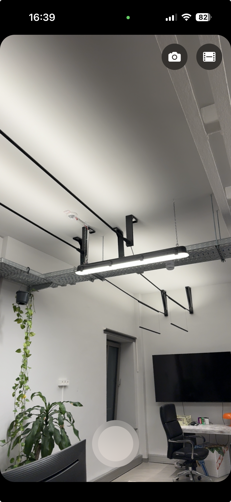

<a href="https://margelo.com">
  <picture>
    <source media="(prefers-color-scheme: dark)" srcset="./images/banner-dark.webp" />
    <source media="(prefers-color-scheme: light)" srcset="./images/banner-light.webp" />
    
  </picture>
</a>

<br />

<div>
  
</div>

### Features

VisionCamera is a powerful, high-performance Camera library for React Native. It features:

* 📸 Photo and Video capture
* 👁️ QR/Barcode scanner
* 📱 Customizable devices and multi-cameras ("fish-eye" zoom)
* 🎞️ Customizable resolutions and aspect-ratios (4k/8k images)
* ⏱️ Customizable FPS (30..240 FPS)
* 🧩 [Frame Processors](https://visioncamera.margelo.com/docs/frame-output) (JS worklets to run facial recognition, AI object detection, realtime video chats, ...)
* 🎨 Drawing shapes, text, filters or shaders onto the Camera
* 🔍 Smooth zooming (Reanimated)
* ⏯️ Fast pause and resume
* 🌓 HDR & Night modes
* ⚡ Custom C++/GPU accelerated resizer (Metal/Vulkan)

Install VisionCamera from npm:

```sh
npm i react-native-vision-camera
cd ios && pod install
```

..and get started by [setting up permissions](https://react-native-vision-camera.com/docs/guides)!

### Documentation

- [Documentation Website](https://visioncamera.margelo.com)
- [Documentation LLMs.txt](https://visioncamera.margelo.com/llms.txt)
- [Community Discord](https://margelo.com/discord)
- [Example App](./apps/simple-camera/)

### VisionCamera V4

As VisionCamera V5 is released, VisionCamera V4 is no longer actively maintained.
The VisionCamera V4 code has been archived under [margelo/react-native-vision-camera-v4-snapshot](https://github.com/margelo/react-native-vision-camera-v4-snapshot), and the old documentation page is deployed at https://visioncamera4.margelo.com.

### ShadowLens

To see VisionCamera in action, check out [ShadowLens](https://mrousavy.com/projects/shadowlens)!

<div>
  <a href="https://apps.apple.com/app/shadowlens/id6471849004">
    
  </a>
  <a href="https://play.google.com/store/apps/details?id=com.mrousavy.shadowlens">
    
  </a>
</div>

### Example

```tsx
function App() {
  return (
    <Camera
      style={StyleSheet.absoluteFill}
      device="back"
      isActive={true}
    />
  )
}
```

> See the [example](./apps/simple-camera/) app

### Adopting at scale

VisionCamera is built by [Margelo](https://margelo.com).
We make apps better and faster.

### Socials

* 🐦 [**Follow me on Twitter**](https://twitter.com/mrousavy) for updates
* 📝 [**Check out my blog**](https://mrousavy.com/blog) for examples and experiments
* 💬 [**Join the Margelo Community Discord**](https://margelo.com/discord) for chatting about VisionCamera
