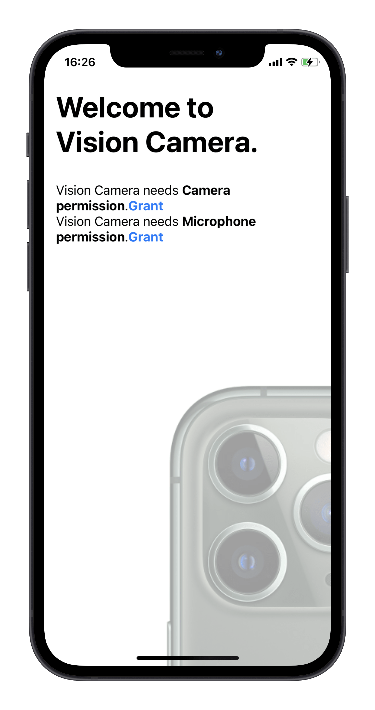

<table>
<tr>
<th><a href="../README.md">README</a></th>
<th>SETUP</th>
<th><a href="./DEVICES.md">DEVICES</a></th>
<th><a href="./FORMATS.md">FORMATS</a></th>
<th><a href="./FRAME_PROCESSORS.md">FRAME_PROCESSORS</a></th>
<th><a href="./ANIMATED.md">ANIMATED</a></th>
<th><a href="./ERRORS.md">ERRORS</a></th>
</tr>
</table>

<br/>

<h1 align="center">Setup</h1>

<div>
  
</div>

## Installing the library

Install react-native-vision-camera through npm:

```sh
npm i react-native-vision-camera
npx pod-install
```

## Updating manifests

To use a Camera or Microphone you must first specify that your app requires camera and microphone permissions.

### iOS

Open your project's `Info.plist` and add the following lines inside the outermost `<dict>` tag:

```xml
<key>NSCameraUsageDescription</key>
<string>$(PRODUCT_NAME) needs access to your Camera to record videos and capture photos.</string>
<key>NSMicrophoneUsageDescription</key>
<string>$(PRODUCT_NAME) needs access to your Microphone to record videos with audio.</string>
```

### Android

Open your project's `AndroidManifest.xml` and add the following lines inside the `<manifest>` tag:

```xml
<uses-permission android:name="android.permission.CAMERA" />
<uses-permission android:name="android.permission.RECORD_AUDIO" />
```

## Permissions

react-native-vision-camera also provides functions to easily get and request Microphone and Camera permissions.

### Getting Permissions

Simply use the **get** functions to find out if a user has granted or denied permission before:

```ts
const cameraPermission = await Camera.getCameraPermissionStatus()
const microphonePermission = await Camera.getMicrophonePermissionStatus()
```

A permission status can have the following values:

* `authorized`: Your app is authorized to use said permission. Continue with mounting the `<Camera>` view.
* `not-determined`: Your app has not yet requested permission from the user. [Continue by calling the **request** functions.](#requesting-permissions)
* `denied`: Your app has already requested permissions from the user, but was explicitly denied. You cannot use the **request** functions again, but you can use the [`Linking` API](https://reactnative.dev/docs/linking#opensettings) to redirect the user to the Settings App where he can manually grant the permission.
* `restricted`: (iOS only) Your app cannot use the Camera or Microphone because that functionality has been restricted, possibly due to active restrictions such as parental controls being in place.

### Requesting Permissions

Use the **request** functions to prompt the user to give your app permission to use the Camera or Microphone.

> Note: You can only use **request** functions if the current permission status is `not-determined`.

```ts
const newCameraPermission = await Camera.requestCameraPermission()
const newMicrophonePermission = await Camera.requestMicrophonePermission()
```

The permission request status can have the following values:

* `authorized`: Your app is authorized to use said permission. Continue with mounting the `<Camera>` view.
* `denied`: Your app has already requested permissions from the user, but was explicitly denied. You cannot use the **request** functions again, but you can use the [`Linking` API](https://reactnative.dev/docs/linking#opensettings) to redirect the user to the Settings App where he can manually grant the permission.

<br />

#### 🎉 Hooray! You're ready to learn about [devices](./DEVICES.md)!
